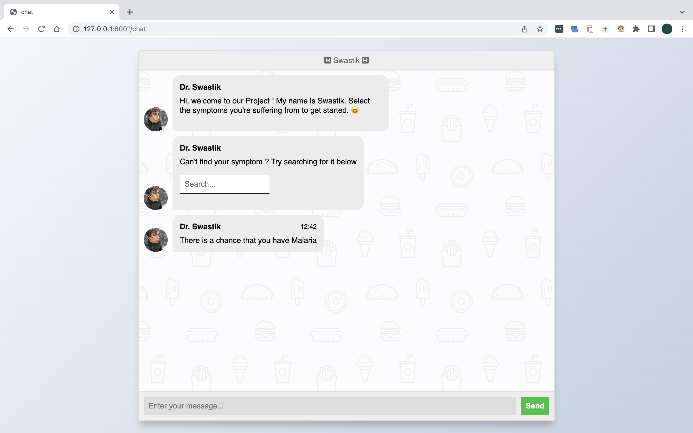
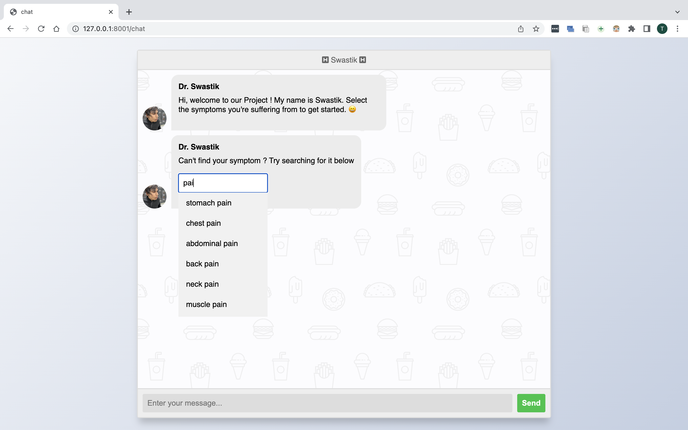

<h1>Welcome to our project!!</h1>

<h3>Problem Statement</h3>

Developing an AI-based personalised health monitoring system that can adapt to individual health conditions and provide personalised health recommendations.</p?

<h3>Proposed Solution</h3>

We will develop an AI-based personalised system that can adapt to individual health conditions and provide personalised health recommendations. The system will be able to converse with users. It will use machine learning algorithms to identify patterns, trends, and anomalies in chat, and provide personalised health recommendations to the user. The goal is to provide an efficient and effective health monitoring system that can help individuals improve their health and wellness.

